<div align="center">

# ⚡ pocketbase-ts-starter

**PocketBase with TypeScript hooks & migrations — typechecked, linted, shipped in a single Docker image.**

[](https://pocketbase.io)
[](https://www.typescriptlang.org)
[](https://bun.sh)
[](https://biomejs.dev)
[](https://github.com/raelsei/pocketbase-ts-starter)

</div>

PocketBase's JS hooks are great until the file is 400 lines of untyped JavaScript with a
typo in a field name that only shows up at runtime. This starter gives you the full
`$app` / `core.*` / `routerAdd` surface in **strict TypeScript**, checks it with `tsc` and
Biome, and packages the result into one self-contained image with production hardening
already applied.

- **Typed everything** — vendored `types.d.ts` from PocketBase itself; `new TextField({...})`,
  `e.json(...)`, `app.settings()` all autocomplete and typecheck.
- **No bundler surprises** — esbuild *transpiles* file-by-file into the exact layout goja
  expects. What you write is what PocketBase runs.
- **Hot reload in dev** — `bun run watch` + PocketBase's own `pb_hooks` watcher.
- **One image for prod** — multi-stage Dockerfile, non-root, healthcheck, resource limits,
  rate limiter, trusted proxy, encrypted settings. No compiled artifacts in git.

## How it works

<picture>
  <source media="(prefers-color-scheme: dark)" srcset="docs/architecture-dark.svg">
  
</picture>

`pb_hooks/` and `pb_migrations/` are build output (gitignored). The Dockerfile runs the same
build in a Bun stage, then copies the JS into a tiny Alpine image next to the PocketBase binary.

## Quick start

Requires [Bun](https://bun.sh) and Docker.

```bash
git clone https://github.com/raelsei/pocketbase-ts-starter && cd pocketbase-ts-starter
cp .env.example .env       # PB_ENCRYPTION_KEY (openssl rand -hex 16) + admin credentials
bun install
bun run build              # src/ -> pb_hooks/ + pb_migrations/
bun run up                 # docker compose up -d --build
```

Open the dashboard at `http://localhost:8090/_/`. On first boot the migrations run (example
`posts` collection, rate limiter, trusted proxy) and the superuser from `.env` is created.
`curl localhost:8090/api/ping` hits the example hook.

## Project layout

```text
.
├── src/
│   ├── hooks/
│   │   ├── main.pb.ts          # routes + app hooks (*.pb.ts files are auto-loaded by PB)
│   │   └── lib/response.ts     # shared code, require()'d from inside handlers
│   └── migrations/
│       ├── 1788220800_settings.ts      # rate limits + trusted proxy
│       └── 1788220801_create_posts.ts  # example collection
├── types/
│   ├── pocketbase-jsvm.d.ts    # generated by PocketBase (pb_data/types.d.ts), vendored
│   └── globals.d.ts            # require(), console — present in goja, missing from types.d.ts
├── scripts/build.ts            # esbuild transpile (no bundling), --watch for dev
├── Dockerfile                  # bun build stage -> alpine + pocketbase, runs as uid 1000
├── entrypoint.sh               # superuser upsert, IP allowlist, volume permission check, serve
├── compose.yml                 # dev: bind mounts, port 8090
└── compose.prod.yml            # prod: self-contained image, named volume, limits
```

## Development

Run `bun run watch` in one terminal. esbuild rebuilds on save; PocketBase watches the
bind-mounted `pb_hooks/` (see `compose.yml`) and reloads the hooks on change.

| Script | What it does |
| --- | --- |
| `bun run build` / `watch` | transpile TS → `pb_hooks/`, `pb_migrations/` |
| `bun run check` | Biome lint + `tsc --noEmit` |
| `bun run fix` | Biome autofix + format |
| `bun run up` / `down` / `logs` | docker compose lifecycle |

Migrations run at boot, not on file change: after adding one, `docker compose restart pocketbase`.

### The one rule of PB hooks

PocketBase serializes **every handler and runs it in an isolated context** — nothing from
the outer scope of the file is reachable inside it. That is why this starter transpiles
instead of bundling: a bundle would hoist your helpers into a scope the handler never sees.

Share code via `require` *inside* the handler and type it with an `import type`, which is
erased at build time:

```ts
import type * as response from "./lib/response";

routerAdd("GET", "/api/ping", (e) => {
    const { json } = require(`${__hooks}/lib/response.js`) as typeof response;
    return json(e, { message: "pong" });
});
```

Files under `src/hooks/lib/` compile to CommonJS modules; top-level `*.pb.ts` files compile
to plain scripts that PocketBase loads on boot.

### Migrations in TypeScript

The same `migrate(up, down)` API as JS, but with typed field classes and settings:

```ts
migrate(
    (app) => {
        const collection = new Collection({ type: "base", name: "posts" });
        collection.fields.add(
            new TextField({ name: "title", required: true, max: 200 }),
            new BoolField({ name: "published" }),
            new AutodateField({ name: "created", onCreate: true }),
        );
        app.save(collection);
    },
    (app) => {
        app.delete(app.findCollectionByNameOrId("posts"));
    },
);
```

`src/migrations/` is the **only** schema source. Automigrate is disabled, so collections
created in the dashboard are not written back as migration files — port them by hand
(or use the dashboard in dev, then copy the JSON the API returns into a migration).

## Configuration

All runtime configuration is environment variables, read by `entrypoint.sh`:

| Variable | Required | Purpose |
| --- | --- | --- |
| `PB_ENCRYPTION_KEY` | prod: yes | 32 hex chars (`openssl rand -hex 16`). SMTP/S3 secrets are stored encrypted with it. **Losing it loses those settings.** |
| `PB_ADMIN_EMAIL` / `PB_ADMIN_PASSWORD` | no | Superuser created (or password updated) on every boot. Remove after first boot if you prefer. |
| `PB_SUPERUSER_IPS` | recommended | Space-separated IPs/CIDRs allowed to use superuser tokens. Everything else gets 403. |
| `PB_HTTP_PORT` | no | Host port for `compose.prod.yml` (default `8090`, loopback only). |
| `GOMEMLIMIT` | set in prod compose | Go soft memory limit; keep it ~85% of the container memory limit. |

## Production

```bash
docker compose -f compose.prod.yml up -d --build
```

The image is self-contained (no hook/migration mounts), `pb_data` is a named volume, and the
port is bound to `127.0.0.1` so a host reverse proxy (Caddy, nginx) can front it. For an
in-Docker proxy (Dokploy, Traefik, nginx-proxy) remove `ports:` and join the proxy network
via the commented block at the bottom of the file.

> **Never expose PocketBase directly to the internet.** The trusted-proxy migration makes PB
> believe `X-Forwarded-For`. Without a reverse proxy in front that overwrites the header,
> any client can forge it and bypass both the rate limiter and the superuser IP allowlist.
> `compose.prod.yml` binds to loopback for exactly this reason; the dev `compose.yml`
> (`8090:8080`) is for localhost only.

### Hardening baked in

| | |
| --- | --- |
| 🔐 **Superuser IP allowlist** | `PB_SUPERUSER_IPS` → requests outside the list get 403, even with a valid token |
| 🚦 **Rate limiter** | `*:auth` 2/3s · `*:create` 20/5s · `/api/batch` 3/1s · `/api/` 300/10s — per client IP |
| 🕵️ **Real client IP** | trusts `X-Forwarded-For` (rightmost hop) so both of the above see the real client |
| 🔑 **Settings encryption** | `PB_ENCRYPTION_KEY` → SMTP/S3 secrets encrypted at rest |
| 👤 **Non-root container** | PocketBase runs as `pb` (uid 1000); `pb_data` volume is owned by it |
| 🔒 **Locked-down container** | `read_only` rootfs, `cap_drop: ALL`, `no-new-privileges`; only `pb_data` and `/tmp` are writable |
| 🧱 **No automigrate** | `src/migrations` is the only schema source; dashboard edits never leak into prod |
| 📏 **Resource limits** | 8 CPU / 8 GB / `GOMEMLIMIT=7GiB` / `nofile=65536` — adjust to your box |
| 🪵 **Log rotation** | Docker json-file capped at 3 × 10 MB, so logs can never fill the disk SQLite lives on |
| 🩺 **Healthcheck** | `GET /api/health` every 30 s → container flips to `unhealthy`, which Dokploy/Traefik/Swarm act on |

### Go-live checklist (dashboard)

These live in the database, not in the repo, so they are per-environment and set once in
the dashboard:

1. **Settings → Application**: *Application URL* (defaults to `http://localhost:8090` — every
   verification / password-reset link in every e-mail points there until you change it),
   *Application name*, *Sender name/address*.
2. **Settings → Mail**: SMTP. Send yourself a test mail.
3. **Settings → Backups**: S3 bucket + cron. Local backups on the same disk are not backups.
4. **Superuser MFA/OTP** — only *after* SMTP works, or you lock yourself out.
5. Behind **Cloudflare** (or any second proxy hop)? Change the trusted-proxy header in
   `src/migrations/1788220800_settings.ts` to `CF-Connecting-IP`. With two hops the rightmost
   `X-Forwarded-For` entry is the CDN's IP, so every user shares one rate-limit bucket and
   `*:auth` 2/3s locks everybody out at once.
6. **Settings → Logs**: `Log IP` is on by default (5-day retention). Mention it in your privacy
   policy or turn it off.

### Dokploy / Coolify / any docker host

- Use a **volume mount**, not a bind mount. Named volumes inherit the `pb` ownership from
  the image; a bind mount is created by root and PocketBase (uid 1000) cannot write to it.
- Upgrading an existing deployment that ran as root? The first boot fails with an explicit
  message from `entrypoint.sh` instead of a cryptic SQLite error. Fix once and redeploy:

  ```bash
  docker run --rm -v <VOLUME_NAME>:/d alpine chown -R 1000:1000 /d
  ```

- Never put `pb_data` on NFS/SMB/network storage. SQLite locking breaks; you will corrupt data.
- Swarm mode ignores `ulimits` (harmless — Go raises the soft limit itself) and honors
  `deploy.resources`.

### Sizing

PocketBase is one process on one SQLite file: **reads scale with cores, writes do not**
(single writer, fsync per transaction), and there is no horizontal scaling — a second
instance cannot share the database. Rough expectations for a 2 vCPU / 4 GB VPS with NVMe:

| | |
| --- | --- |
| Reads (list/view with API rules) | ~1–3k req/s |
| Writes | ~300–1k req/s, roughly flat as you add cores |
| Realtime (SSE) | thousands of concurrent subscribers; cost grows with `subscribers × rules` per change |
| JS hooks on the hot path | divide the above by ~5–10; goja is much slower than Go |

In user terms that is several thousand concurrently active users for a read-heavy app on a
cheap box. If you are write-bound, batch and debounce on the client before you buy a bigger
server; beyond that, PocketBase is not the right tool. Benchmark your own schema with
[pocketbase/benchmarks](https://github.com/pocketbase/benchmarks).

## Upgrading PocketBase

1. Bump `PB_VERSION` in `compose.yml` and `compose.prod.yml` (the Dockerfile default too).
2. Rebuild and boot in dev: `bun run up`.
3. Refresh the vendored types from the file PocketBase generates on boot:

   ```bash
   cp pb_data/types.d.ts types/pocketbase-jsvm.d.ts
   bun run check
   ```

4. Read the [release notes](https://github.com/pocketbase/pocketbase/releases) for hook API
   changes; `tsc` will point at most of them.
